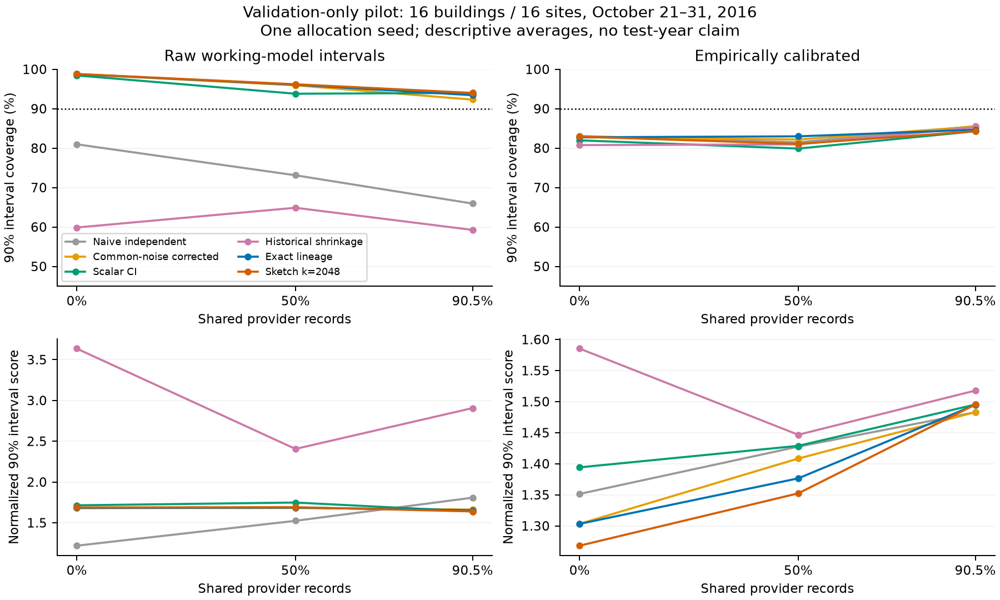
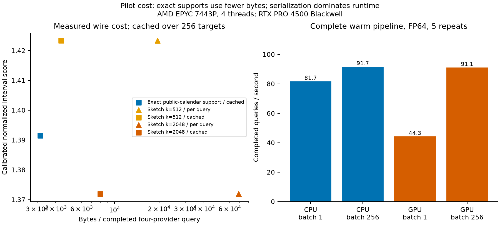

# Stage 1: completed pilot and stop decision

**Recommendation: stop the present sketch branch.** Preserve the implementation
and negative contract diagnostic; do not launch the 24-hour main study. This
pilot establishes a working bounded interface and numerical corollary, not a
new general fusion theorem, calibrated real-world guarantee, or successful paper.

## Completed work

The pinned BDG2 data audit selected 16 buildings at 16 sites using training data
alone. Four fixed calendar OLS providers per building each use 42 complete days
(1,008 records). Shared cores contain 0, 21 or 38 days. Pairwise intersections
are therefore 0, 504 and 912 records; unions contain 4,032, 2,520 and 1,296 records.
Per-provider sample count stays fixed while total unique evidence shrinks.
One allocation seed and two projection seeds are frozen in the manifests.

There are 48 building/allocation conditions, 192 provider fits, 4,096 distinct
scheduled building-target origins, and 1,856
observed scoring targets. The two sketch representations process 24,576 query
sets / 98,304 provider messages. They are not additional observations. There are
no duplicate packets in the outcome study; controlled protocol tests add them.
Only three calendar week groups appear in scoring, two partial. All 2017 outcomes
remain sealed, so no annual, seasonal-test or general deployment claim is made.

The first attempt stopped during training-only OOF rank checking before scoring.
The fixed rank-reduction rule was then applied and the successful complete pilot
took **206.40 seconds**. Existing data and the original
allocation clock were preserved. No model/seed/overlap retuning followed results.

Implemented: canonical identities, immutable binary messages, duplicate and
revision resolution, finite sketch epochs, target/unit checks, QR influence,
FP64 convex fusion with gap checks and individual fallback, optimized scalar CI,
exact conservative lineage, Ledoit–Wolf historical covariance, uninflated
sketches, seasonal naive, all individuals, equal weights, common-noise correction
and a privileged pooled predictor. The deployable consumer has no outcome or
exact-influence argument. An explicitly richer exact interface reconstructs
operators from public calendar features and compressed support identities.

## Mathematics and checks

**34 passed in 1.13s.** The retained controlled panel has 54 condition families, 108
projection evaluations and 36 distinct projection draws (shared across three
noise settings). There were **zero observed projection-event failures and zero
within-event inequality failures**. These counts are numerical diagnostics,
not statistical verification of the advertised probability.

The illustrative optimum is `(4/15,4/15,7/15)`, mean 105.2 and variance 43/15.
Tests cover zero/duplicate/signed influence, unequal scales, near singularity,
an independent SciPy solver and a two-provider ESCI connection. Shared future
noise cannot disappear under disjoint IDs. A deliberate correlated-innovation
example, omitted future noise and projection-adaptive nullspace vector remain
explicit assumption violations.

Pilot epsilons are 0.463341 (k=512) and
0.207477 (k=2048), based on 12,288 queries and delta=.005 each.
Both epochs used exactly their declared capacity. Maximum observed normalized
Gram errors were 0.255269 and
0.128806, respectively. Maximum
relative QP gap was 1.27e-15. Main wire/numerics
are FP64; the maximum measured FP32 Gram discrepancy was
2.76e-06 relative to exact norm products.
No formal floating-point certificate is claimed. See [PROOF_AUDIT.md](../docs/PROOF_AUDIT.md).

## Real outcomes: raw versus empirical calibration

The local OOF scales and shared future variance are working empirical quantities.
The common future term is the mean of provider-local training OOF MSEs; it is
not an identified physical decomposition. Under this convention, training
influence accounts for **4.28%** of
individual modeled predictive variance on average (condition means range
3.35%–5.91%).
Monthly training bias/RMSE, residual autocorrelation and historical provider-error
correlations are retained in `residual_diagnostics.json` and `diagnostics.json`.
Training residual lag-1 correlation averages 0.844 (lag-24: 0.486), so independent
innovations are not a defensible empirical default for these regressions.

Scores average allocation conditions within each building, then buildings equally.
Intervals are symmetric standardized-error quantile corrections fitted only on
October 11–20. Reservation is the fitted one-sided 0.8 quantile, clipped at zero,
with illustrative 4:1 under/over costs; these are not electricity tariffs.

| Method | Raw 90% coverage | Cal. 90% coverage | Cal. 95% coverage | Cal. normalized IS90 | Cal. normalized reservation loss |
|---|---:|---:|---:|---:|---:|
| Seasonal naive | 90.21% | 86.00% | 95.19% | 1.4505 | 0.4464 |
| Individual 2 (one of four) | 94.92% | 84.31% | 89.96% | 1.3806 | 0.3674 |
| Equal weights | 95.64% | 83.40% | 90.77% | 1.4208 | 0.3667 |
| Naive independence | 73.34% | 83.38% | 90.73% | 1.4206 | 0.3666 |
| Common-noise corrected | 95.67% | 83.47% | 90.24% | 1.3982 | 0.3657 |
| Optimized scalar CI | 95.42% | 82.05% | 89.47% | 1.4394 | 0.3876 |
| Historical shrinkage | 61.33% | 82.34% | 90.27% | 1.5166 | 0.3730 |
| Exact lineage | 96.10% | 83.47% | 89.86% | 1.3915 | 0.3668 |
| Sketch k=512 | 95.46% | 82.63% | 90.03% | 1.4234 | 0.3825 |
| Sketch k=2048 | 96.35% | 82.76% | 90.29% | 1.3719 | 0.3694 |
| Uninflated k=2048 | 96.08% | 83.47% | 89.92% | 1.3880 | 0.3671 |
| Pooled raw-data reference | 96.49% | 81.74% | 89.18% | 1.4155 | 0.3627 |

All four individual results, MAE, RMSE, bias and raw widths are retained in
[`summary_metrics.csv`](../results/summary_metrics.csv). Individual 2 is shown
as a strong member of the prespecified baseline family, not selected as a new
deployable rule after scoring. Duplicate-aware independence equals ordinary
independence here because all primary estimator messages are distinct.

Exact lineage improves calibrated normalized interval score by only **0.48%**
over common-noise-corrected independence and slightly worsens reservation loss.
The k=2048 sketch score is 1.41% lower than exact lineage, with 0.71 percentage
points less 90% coverage, but all these calibrated coverage levels are well below
90%. This is not evidence that sketching is intrinsically superior to exact
information. Its extra inflation changes empirical weights and scale correction.
The sketch's score improvement over individual 2 is under 1%, with lower coverage.
No 5% practical advantage over the strongest deployable family is established.

The large raw difference from naive independence mostly disappears after keeping
the common future term. Raw corrected intervals cover about 96% at nominal 90%,
and their chronological calibration does not transfer reliably. The short
historical covariance window is especially weak for the shrinkage estimate;
these results do not establish a general failure of learned covariance fusion.

[`paired_sensitivity.json`](../results/paired_sensitivity.json) resamples all
sites/buildings/methods together across the three observed week groups 1,000 times,
after averaging allocation replicates within targets. With two partial weeks,
its ranges are descriptive sensitivity only. The sketch-minus-exact interval-score
range includes zero. Site-level and site-deletion results and the cleaned-mask
sensitivity are retained; none was used to select a winning configuration.

## Metadata, computation and hardware

For all 48 allocations, a real lossless exact-support message reconstructed the
full signed operator with **zero measured absolute difference**. Its total size
for all four providers is 1039–1071
bytes once per model set (mean **1059 bytes**), including
the public feature recipe, canonical time dictionary, active columns and scales.
Decode/reconstruction takes 6.43
ms on average. It exposes exact support IDs and assumes public calendar features;
it is deployable only under that richer contract, not a hidden-data oracle.

The four k=2048 cached sketch operators occupy about
**1.246 MB** once, before the
same dynamic query headers. Per-query FP64 sketch messages cost
**68.69 KB** per four-provider query.
The 256-query amortized plot charges identical dynamic-header bytes to both
contracts, so exact exchange is not credited with free headers or model refreshes.
The sketch fails the provisional 2x saving gate against compressed/cached exact
lineage. Per-query FP32 payload arithmetic is reported separately, not as a timed
or formally certified alternative.

| Backend / batch | Warm p50 | Warm p95 | Queries/s |
|---|---:|---:|---:|
| CPU / 1 | 12.24 ms | 13.03 ms | 81.68 |
| CPU / 256 | 2792.72 ms | 2967.14 ms | 91.67 |
| GPU / 1 | 22.60 ms | 22.89 ms | 44.25 |
| GPU / 256 | 2809.79 ms | 2846.23 ms | 91.11 |

| Backend / batch | Cold p50, 5 repeats | Cold p95, 5 repeats |
|---|---:|---:|
| CPU / 1 | 0.3000 s | 0.3007 s |
| CPU / 256 | 3.0186 s | 3.0782 s |
| GPU / 1 | 0.3065 s | 0.5351 s |
| GPU / 256 | 2.9916 s | 3.0165 s |

Cold model-state latency includes reading frozen local operators/features,
canonical ID construction, fresh Gaussian columns, operator transfer/setup,
wire parsing/validation, optimization and output. Five replicates supply each
cold percentile; these measurements supplement rather than replace the original
warm records. Model fitting and archive preparation are separate study setup,
and the OS disk cache is not evicted. Add the
measured 0.275 s CUDA initialization once to
the first GPU use. The supplementary cold run starts after device inspection;
its explicit `cuda.init` timing excludes context setup and is not a startup
measurement. Per-allocation cold costs and stage decomposition
are in `pilot_costs.csv`. For k=2048 the average serialization/parse/validation
stage takes 2.901 s per 256 queries, versus
0.0140 s for the CPU convex solver. No useful complete
pipeline GPU speedup appears at the measured sizes; single-query GPU latency is
higher. This is not a claim about all batch sizes or other representations.

The matched GPU replay uses actual frozen provider operators and inputs, FP64,
explicit synchronization, transfers, parsing and output encoding. CPU/GPU mean
and variance disagreement is at most 4.26e-14
and 5.68e-14, respectively.
Peak CUDA allocation is 176.7 MiB; peak
benchmark RSS is 1.427 GB. CUDA event intervals
sum to 1.141481 seconds across both benchmark packages. The conservative
allocated Stage 1 window is **2947.0 seconds (0.819 h)**,
below its two-hour ceiling. Billing allocation outside this window is unknown.

## Main-study readiness and gates

| Buildings | Primary warm replay | With 25% margin + 8 h other work | Fits 24 h? |
|---|---:|---:|---|
| 16 | 3.82 h | 12.78 h | yes |
| 32 | 7.65 h | 17.57 h | yes |
| 64 | 15.29 h | 27.14 h | no |
| 128 | 30.58 h | 46.28 h | no |

These are linear projections from measured CPU warm FP64 replay, not actual
full-year runs. The 25% margin and eight hours for other work are explicit planning
assumptions, charging wall time while the GPU pod remains allocated. A later
CPU-only execution without an allocated GPU would have different accounting.
The 128-building primary replay alone takes about 30.6 hours and
would transmit roughly 693 GB in this uncached representation. The 32-building
scenario projects below 24 hours but fails the original minimum 64-building
evidence target. Cached exact exchange suggests a cheaper different study; no
unmeasured cached-sketch speedup is substituted into this projection.

`python scripts/run_main_study.py --authorize-main --max-gpu-hours 24` is a
fail-closed launcher: it refuses the false authorization flag in the frozen
config, failed scientific gate, or missing reviewed job list. After a separately
authorized revision it can enforce a persistent total cap, including Stage 1,
on an explicit foreground job list. **Full-study execution remains blocked by
failed scientific gates and the absence of an approved job list.** No full-study
job was launched.

Gate assessment: numerical correctness passes; rough compressed-vs-exact quality
thresholds pass on this short empirical pilot; useful compression fails;
complete-pipeline GPU advantage fails at tested sizes; practical advantage is
not established; mathematical novelty is unproven. The newer conservative
covariance-compression literature further weakens a broad theorem claim.

Preserve this package as an auditable negative/contract diagnostic. A paper would
need a substantive revised question and stronger evidence, not more seeds or
smaller training pools chosen to make overlap matter. Do not fund the main sketch
run from these results alone.

## Reproduction, limits and final state

The [README](../README.md) gives exact pilot, plotting and saved-results checks.
Configuration, source hashes, epoch registries, provider allocations, licenses,
environment snapshot and small numeric outputs are committed. Raw source and
per-target observed readings remain outside git. No submission, external message,
service deployment, new compute rental or new branch occurred. Work follows the
user-authorized `main` workflow.

Stage 1 intentionally does not implement the full 2017 experiment, p=32/64
scaling, a second allocation seed, optional refresh, neural models or claimed
operational federation. No empirical Gaussian, privacy, resilience or tail-event
guarantee is inferred. Final runtime inspection shows no active research worker;
the user's pod remains allocated. See [FEASIBILITY_REPORT.md](FEASIBILITY_REPORT.md)
for the archive/license and venue conditions that remain unresolved.
